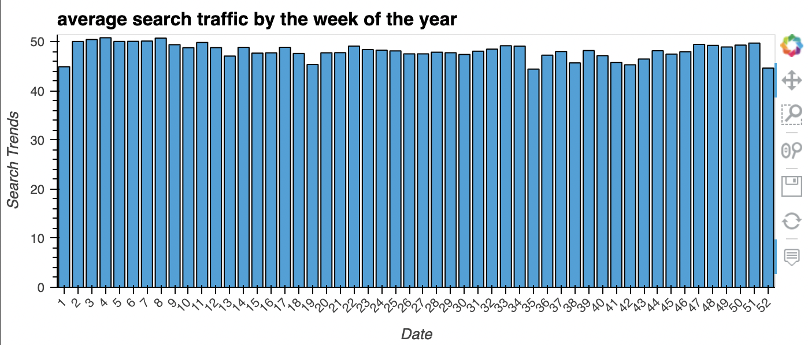

# **Columbia University Engineering, New York FinTech BootCamp** 
# **August 2022 Cohort**
## *Module 11, Challenge -  Google Colab and Time Series Analysis with FB Prophet*

Objective - Tasked with analyzing a company's financial and user data in innovative manner to facilitate company grow.

Scenario - As growth analyst at MercadoLibre, the most popular e-commerce site in Latin America, analyze the corporate financial and user data.  Identify potential patterns and predicatble features that may translate into the ability to successfully trade the stock.

Product - Jupyter notebook containing data preparation, analysis, and visualizations for all the time series data that the company needs to understand. Specifically, this file should contain the following:

    Visual depictions of seasonality (as measured by Google Search traffic) that are of corporate interest.
    evaluation of corporate stock price correlation to Google Search traffic.
    Prophet forecast model that for hourly user search traffic predictions.
    (Optional) A plot of a forecast for the company’s future revenue.


---
## **Methods**
### The code script analysis performed:

    Initiate Google Colab
    Import starter code and target Data from CSV files (provided in the starter code)
        Read the csv files from the Resources folder into a DataFrames
        
    Prepare the Data
        Generate the summary statistics, and use HvPlot to visualize your data inspect DataFrame contents

___


___

Supplemental processing and analysis:

Beyond the scope of the assignment, the author sought to conduct additional analysis of the data obtained; supplemental visulizations provided.  




---
## **Technologies**
---
### **Dependencies**

This project leverages Jupyter Lab v3.4.4 and python v3.9.13 with the following packages:

* [PyStan](https://pystan.readthedocs.io/en/latest/#:~:text=PyStan%20is%20a%20Python%20interface,and%20high%2Dperformance%20statistical%20computation.) - from PyPI, is a Python interface to Stan, a package for Bayesian inference; Stan® is a state-of-the-art platform for statistical modeling and high-performance statistical computation.

* [Prophet](https://pypi.org/project/fbprophet/#:~:text=Prophet%20is%20a%20procedure%20for,several%20seasons%20of%20historical%20data.) - is a procedure for forecasting time series data based on an additive model where non-linear trends are fit with yearly, weekly, and daily seasonality, plus holiday effects; works best with time series that have strong seasonal effects and several seasons of historical data.

* [hvplot](https://hvplot.holoviz.org/getting_started/hvplot.html) - provides a high-level plotting API built on HoloViews that provides a general and consistent API for plotting data into numerous formats listed within linked documentation.

* [HoloViews](https://holoviews.org/) - is an open-source Python library designed to make data analysis and visualization seamless and simple.

* [sys](https://docs.python.org/3/library/sys.html) - module provides access to some variables used or maintained by the interpreter and to functions that interact strongly with the interpreter.

* [NumPy](https://numpy.org/doc/stable/user/absolute_beginners.html) - an open source Python library used for working with arrays, contains multidimensional array and matrix data structures with functions for working in domain of linear algebra, fourier transform, and matrices.

* [pandas](https://pandas.pydata.org/docs/) - software library written for the python programming language for data manipulation and analysis.

* [datetime](https://docs.python.org/3/library/datetime.html#:~:text=The%20datetime%20module%20supplies%20classes,General%20calendar%20related%20functions.) - supplies classes for manipulating dates and times with focus of implementation on efficient attribute extraction for output formatting and manipulation.

* [matplotlib.pyplot](https://matplotlib.org/3.5.3/api/_as_gen/matplotlib.pyplot.html) a state-based interface to matplotlib. It provides an implicit, MATLAB-like, way of plotting. It also opens figures on your screen, and acts as the figure GUI manager

* [Path](https://pandas.pydata.org/docs/reference/api/pandas.concat.html) - from pathlib - Object-oriented filesystem paths, Path instantiates a concrete path for the platform the code is running on.


### **Hardware used for development**

MacBook Pro (16-inch, 2021)

    Chip Appple M1 Max
    macOS Monterey version 12.6

### **Development Software**

Homebrew 3.5.10

    Homebrew/homebrew-core (git revision 0b6b6d9004e; last commit 2022-08-30)
    Homebrew/homebrew-cask (git revision 63ae652861; last commit 2022-08-30)

anaconda Command line client 1.10.0

    conda 22.9.0
    Python 3.8.13
    pandas 1.5.1

Colab specific operation utilization

    Python version 3.7.15 (default, Oct 12 2022, 19:14:55) 
    [GCC 7.5.0]
    pandas version: 1.3.5

pip 22.2.2 from /opt/anaconda3/envs/jupyterlab_env/lib/python3.9/site-packages/pip (python 3.9)


git version 2.37.2

---
## *Installation of application (i.e. github clone)*

 In the terminal, navigate to directory where you want to install this application from the repository and enter the following command

```python
git clone git@github.com:Billie-LS/prophet_for_profits.git
```

---
## **Usage**

Recommended operation via virtual environment, environment created and parameters used as below:

```python
> conda create -n <name_env> python=3.8 anaconda
> conda activate <name_env>

	> pip install --upgrade pip
	> conda update conda
	> conda install numpy cython -c conda-forge
	> conda install matplotlib scipy pandas -c conda-forge
	> conda install pystan -c conda-forge
	> conda install -c anaconda ephem
	> pip install scikit-learn
	> conda install -c conda-forge prophet
	> conda install -c conda-forge jupyterlab=3
	> conda update jupyterlab
	> pip install fire
	> pip install questionary
	> pip install python-dotenv
	> conda install -c pyviz hvplot
	> conda install -c pyviz hvplot geoviews
	> conda update SQLAlchemy
	> conda install -c conda-forge voila
	> pip install pandas_datareader
	> python -m pip install ipykernel

```

___

The installed application is run through Google Colab web-based interactive development environment (IDE) interface:

[GoogleColab](https://colab.research.google.com/)

---
## **Project requirements**
### see starter code

---
## **Version control**

Version control can be reviewed at:

```python
https://github.com/Billie-LS/prophet_for_profits
```

[repository](https://github.com/Billie-LS/prophet_for_profits)


---
## **Contributors**

### **Author**

Loki 'billie' Skylizard
    [LinkedIn](https://www.linkedin.com/in/l-s-6a0316244)
    [@GitHub](https://github.com/Billie-LS)


### **BootCamp lead instructor**

Vinicio De Sola
    [LinkedIn](https://www.linkedin.com/in/vinicio-desola-jr86/)
    [@GitHub](https://github.com/penpen86)


### **BootCamp teaching assistant**

Santiago Pedemonte
    [LinkedIn](https://www.linkedin.com/in/s-pedemonte/)
    [@GitHub](https://github.com/Santiago-Pedemonte)


### **askBCS assistants**

Vijaya Reddy
    [LinkedIn](https://www.linkedin.com/in/vijaya-reddy-209b041a3/)
    [@GitHub](https://github.com/vjreddy2001)

---

### **Additional references and or resources utilized**

[STACK OVERFLOW](https://stackoverflow.com/questions/11346283/renaming-column-names-in-pandas)

[STACK OVERFLOW](https://stackoverflow.com/questions/19573031/cant-push-to-github-because-of-large-file-which-i-already-deleted)


---
## **License**

MIT License

Copyright (c) [2022] [Loki 'billie' Skylizard]

Permission is hereby granted, free of charge, to any person obtaining a copy
of this software and associated documentation files (the "Software"), to deal
in the Software without restriction, including without limitation the rights
to use, copy, modify, merge, publish, distribute, sublicense, and/or sell
copies of the Software, and to permit persons to whom the Software is
furnished to do so, subject to the following conditions:

The above copyright notice and this permission notice shall be included in all
copies or substantial portions of the Software.

THE SOFTWARE IS PROVIDED "AS IS", WITHOUT WARRANTY OF ANY KIND, EXPRESS OR
IMPLIED, INCLUDING BUT NOT LIMITED TO THE WARRANTIES OF MERCHANTABILITY,
FITNESS FOR A PARTICULAR PURPOSE AND NONINFRINGEMENT. IN NO EVENT SHALL THE
AUTHORS OR COPYRIGHT HOLDERS BE LIABLE FOR ANY CLAIM, DAMAGES OR OTHER
LIABILITY, WHETHER IN AN ACTION OF CONTRACT, TORT OR OTHERWISE, ARISING FROM,
OUT OF OR IN CONNECTION WITH THE SOFTWARE OR THE USE OR OTHER DEALINGS IN THE
SOFTWARE.


